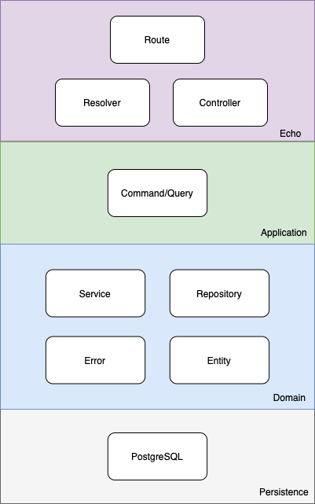

# Example code for DDD microservice architecture in Go
This repository gives an overview of how you could structure a containerised RESTful and/or GraphQL-Application written in Go following a DDD and CQRS approach. It uses gqlgen to generate necessary GraphQL server files, Echo as the HTTP server and framework, gorm for ORM data handling and mapping to DB. A complete list of used Tools and Frameworks can be found later in this README.

## Contents
1. [Intentions](#intentions)
2. [Getting Started](#getting-started)
    * [Noteworthy things that should be considered while developing](#noteworthy-things-that-should-be-considered-while-developing)
3. [Frameworks and Tools](#frameworks-and-tools)
4. [Core Concepts](#core-concepts)
    * [Domain Driven Design Architecture](#domain-driven-design-architecture)
    * [Echo](#echo)
    * [Application](#application)
    * [Domain](#domain)
    * [Persistence](#persistence)
5. [TODOs](#todos)

## Intentions
* Providing an example project that can be used as boilerplate for starting up a project
* Demonstrating the used core-concepts for well-structuring a Go application 
* Learning from mutual feedback and improve this approach

## Getting started
* Clone or download this project

* Generate the GraphQL-Server and Resolver-Interfaces by running `go run github.com/99designs/gqlgen generate` in your project directory

* Starting up the stack using docker compose

* Visit `localhost:8080/playground` for getting started with GraphQL API

* Send HTTP requests to `localhost:8080` based on the path of the endpoint you want to use

### Noteworthy things that should be considered while developing
**Schema-Changes lead you to re-generate**
* Every change in the `schema.graphqls` should be finished with re-generating the GraphQL-Files by running `go run github.com/99designs/gqlgen generate`.

**New Actions are not automatically added to the resolvers-implementation**
* New Actions inside the schema do not lead gqlgen to add them to your resolvers. You are responsible for implement them on your own (The interface containing all necessary functions can be found in `src/infrastructure/graph/server_generated.go`).

## Frameworks and Tools
|Framework/Tool|Description|
|---|---|
|[gorm.io/gorm](https://pkg.go.dev/gorm.io/gorm)|ORM library used to map and manage entities in the database|
|[99design/gqlgen](https://github.com/99designs/gqlgen)|Generating GraphQL-Server and Resolver-Interface based on `schema.graphql`. Can also generate missing models|
|[palantir/stacktrace](https://github.com/palantir/stacktrace)|Used to manage and trace errors and log them on the console|
|[gofrs/uuid](https://github.com/gofrs/uuid)|Used for generation UUIDs for the in-memory database used in this example|
|[dgrijalva/jwt-go](https://github.com/dgrijalva/jwt-go)|Used for generation of a JWT toket for user authentication
|[labstack/echo/v4](https://github.com/labstack/echo/v4)|HTTP server and framework to serve APIs, manage middleware and respond to HTTP requests|
|[go-playground/validator/v10](https://github.com/go-playground/validator/v10)|Used to validate data from HTTP requests before processing them|

## Core Concepts

### Domain Driven Design Architecture
The microservice architecture is structured as shown below where the data flow from an HTTP request follows the graph from top down.

    

### Echo
The framework used to serve HTTP requests. Here the request will be served to either a resolver from graphql or a controller for RESTful APIs.

### Route
Here is where the routes (API endpoints) are defined and an handler and middleware is associated with them.

#### Resolver
Resolvers are GraphQL construct for handling requests.
They are described in the `schema.graphql` file.
An interface for each type of action (Query, Mutation) is created through gqlgen.
This interface holds all possible user-actions and needs to be implemented.
In this example, the implementation is done in the `src/infrasctructure/graph/resolver/resolver.go` file.
For larger projects it might be a good idea to use multiple files instead.

* **Logging**: Logs everything interesting happening in data-transmission. In this example gqlgen should perform this aspect of logging.

* **Errors**: Errors from the domain should be passed through from the application and domain layer.

#### Controller
Here live the controllers of the RESTful APIs implemented.

* **Logging**: Logs everything interesting happening in data-transmission. 

* **Errors**: Errors from the domain should be passed through from the application and domain layer.

### Application
Creates and fetches data from the domain layer. Here CQRS is implemented to separate into queries and commands such that the former implements only read requests with no side effects while the latter implements read requests that have side effects and write requests.

### Domain
Responsible for representing concepts for the business, information about the business situation, and business logic. Within the domain there are repositories which define how data is accessed from the domain layer.

#### Repository
The Repository layer is holding logic for interactions with any kind of data store. This could be a database or streaming-service.

A repository is always defined through an interface before implementing it. This is important to keep it testable. They live inside the `repository`-directory.

* **Logging:** Should not provide logic-based, but technical logging (e.g. connection-failures, timeouts). A not found database-row is mostly not a technical error, even if your db-driver returns an error in this case.

* **Errors:** Errors returned by this layer are not concerned for being seen by the end-user. Errors could contain sensible informations.

#### Service
Your business-logic lives in the Service layer.
Every action a user can do should be implemented in a service layer, but is not to this.

A service could also provide functions used by other services, e.g. retrieving configuration.

Similar to repositories, services should always be described through an interface. So you could mock it during tests. They live inside the `service`-directory.

* **Logging**: Responsible for logic-based logging. Should log faulty actions (retrieving not existing entities, try accessing data without permission)

* **Errors**: Errors should be non-technical and suited for the end-user. Not to much technical details, no sensible informations.

### Persistence
Implements repositories interfaces to provide access to permanent data stores hosted within the microservice itself (cache) or databases.

## TODOs

* Finish implementing graphql types, queries and modifications
* Implement authorisation check in graphql
* Document docker stack
